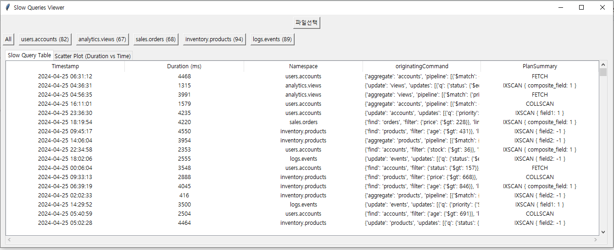
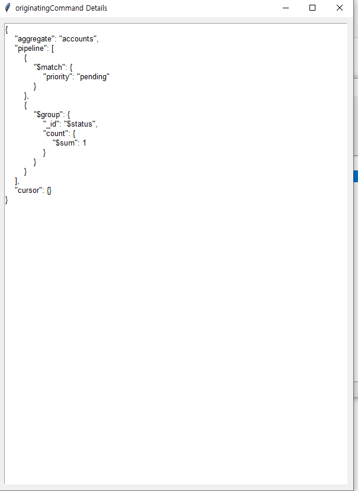
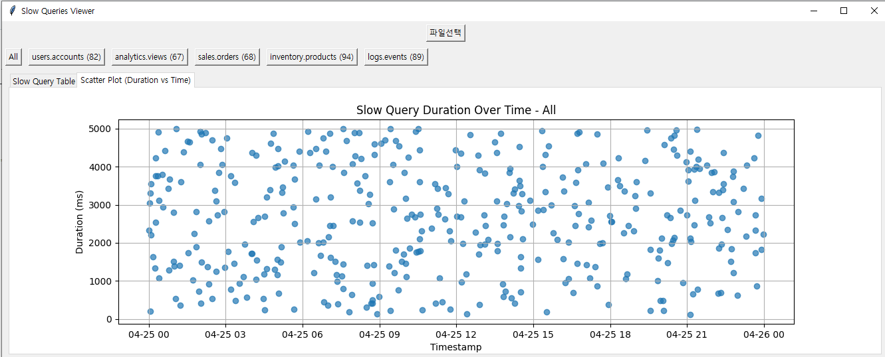

# MongoDB Slow Query Log Viewer

이 툴은 MongoDB의 슬로우 쿼리 로그 파일을 **GUI**를 통해 보여주는 도구입니다.  
슬로우 쿼리를 보다 직관적으로 확인하고 분석할 수 있도록 도와줍니다.

## 기능

- **MongoDB 슬로우 쿼리 로그 파일**을 읽어들여 분석
- 슬로우 쿼리의 **타임스탬프**, **응답 시간**, **쿼리 명령** 등 다양한 정보를 표시
- **필터링 및 정렬 기능** 제공
- **GUI 기반**의 직관적인 인터페이스 제공

## 프로그램 화면







## 설치 방법

1. **필요한 패키지 설치**  
   프로젝트 폴더 내에서 아래 명령어를 사용하여 필요한 패키지를 설치합니다.

   ```bash
   pip install -r requirements.txt

2. **프로그램 실행**  
   Window 환경에서 수행 가능

